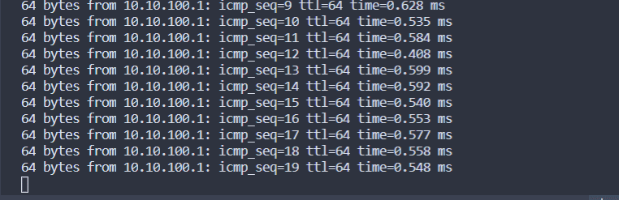

# VLAN LCAP

Проверим что появился интерфейс VLAN и работает одинаковая адрессация, разведенная по VLAN

Связка testClient1 <==> testServer1
```console
[root@testClient1 ~]# ip -br a
lo               UNKNOWN        127.0.0.1/8 ::1/128 
eth0             UP             10.0.2.15/24 fe80::5054:ff:fe4d:77d3/64 
eth1             UP             
eth1.100@eth1    UP             10.10.10.254/24 fe80::a00:27ff:fe3b:b792/64 
[root@testClient1 ~]# ping 10.10.10.1
PING 10.10.10.1 (10.10.10.1) 56(84) bytes of data.
64 bytes from 10.10.10.1: icmp_seq=1 ttl=64 time=0.956 ms
64 bytes from 10.10.10.1: icmp_seq=2 ttl=64 time=0.599 ms
64 bytes from 10.10.10.1: icmp_seq=3 ttl=64 time=0.534 ms
64 bytes from 10.10.10.1: icmp_seq=4 ttl=64 time=0.579 ms
64 bytes from 10.10.10.1: icmp_seq=5 ttl=64 time=0.602 ms
64 bytes from 10.10.10.1: icmp_seq=6 ttl=64 time=0.611 ms
^C
--- 10.10.10.1 ping statistics ---
6 packets transmitted, 6 received, 0% packet loss, time 5000ms
rtt min/avg/max/mdev = 0.534/0.646/0.956/0.144 ms
```
Связка testClient2 <==> testServer2
```console
[root@testServer2 ~]# ip -br a
lo               UNKNOWN        127.0.0.1/8 ::1/128 
eth0             UP             10.0.2.15/24 fe80::5054:ff:fe4d:77d3/64 
eth1             UP             fe80::d99c:a882:fca0:7a0/64 
eth1.101@eth1    UP             10.10.10.1/24 fe80::a00:27ff:feea:8664/64 
[root@testServer2 ~]# ping 10.10.10.254
PING 10.10.10.254 (10.10.10.254) 56(84) bytes of data.
64 bytes from 10.10.10.254: icmp_seq=1 ttl=64 time=0.913 ms
64 bytes from 10.10.10.254: icmp_seq=2 ttl=64 time=0.618 ms
64 bytes from 10.10.10.254: icmp_seq=3 ttl=64 time=0.591 ms
64 bytes from 10.10.10.254: icmp_seq=4 ttl=64 time=0.584 ms
64 bytes from 10.10.10.254: icmp_seq=5 ttl=64 time=0.586 ms
^C
--- 10.10.10.254 ping statistics ---
5 packets transmitted, 5 received, 0% packet loss, time 4003ms
rtt min/avg/max/mdev = 0.584/0.658/0.913/0.129 ms
```

Теперь проверим бонды:
```console
[root@centralRouter ~]# cat /proc/net/bonding/bond0
Ethernet Channel Bonding Driver: v3.7.1 (April 27, 2011)

Bonding Mode: fault-tolerance (active-backup) (fail_over_mac active)
Primary Slave: None
Currently Active Slave: eth2
MII Status: up
MII Polling Interval (ms): 100
Up Delay (ms): 0
Down Delay (ms): 0

Slave Interface: eth2
MII Status: up
Speed: 1000 Mbps
Duplex: full
Link Failure Count: 0
Permanent HW addr: 08:00:27:10:33:5d
Slave queue ID: 0

Slave Interface: eth3
MII Status: up
Speed: 1000 Mbps
Duplex: full
Link Failure Count: 0
Permanent HW addr: 08:00:27:62:19:9c
Slave queue ID: 0

[root@centralRouter ~]# ip -br a
lo               UNKNOWN        127.0.0.1/8 ::1/128 
eth0             UP             10.0.2.15/24 fe80::5054:ff:fe4d:77d3/64 
eth1             UP             10.10.10.2/24 fe80::a00:27ff:feae:f36d/64 
eth2             UP             
eth3             UP             
bond0            UP             10.10.100.2/24 fe80::a00:27ff:fe10:335d/64 
```
```console
[root@inetRouter ~]# cat /proc/net/bonding/bond0
Ethernet Channel Bonding Driver: v3.7.1 (April 27, 2011)

Bonding Mode: fault-tolerance (active-backup) (fail_over_mac active)
Primary Slave: None
Currently Active Slave: eth1
MII Status: up
MII Polling Interval (ms): 100
Up Delay (ms): 0
Down Delay (ms): 0

Slave Interface: eth1
MII Status: up
Speed: 1000 Mbps
Duplex: full
Link Failure Count: 0
Permanent HW addr: 08:00:27:64:89:27
Slave queue ID: 0

Slave Interface: eth2
MII Status: up
Speed: 1000 Mbps
Duplex: full
Link Failure Count: 0
Permanent HW addr: 08:00:27:92:8f:6f
Slave queue ID: 0
[root@inetRouter ~]# ip -br a
lo               UNKNOWN        127.0.0.1/8 ::1/128 
eth0             UP             10.0.2.15/24 fe80::5054:ff:fe4d:77d3/64 
eth1             UP             
eth2             UP             
bond0            UP             10.10.100.1/24 fe80::a00:27ff:fe64:8927/64
```
Смотрим пинги с центрального роутера на инет роутер:
Обращаем внимание на пакеты номер 26 и 38, в это время мы последовательно на инет роутере гасим и поднимаем **eth1** и **eth2**




Как видим линк не рвется, бондинг работает.


