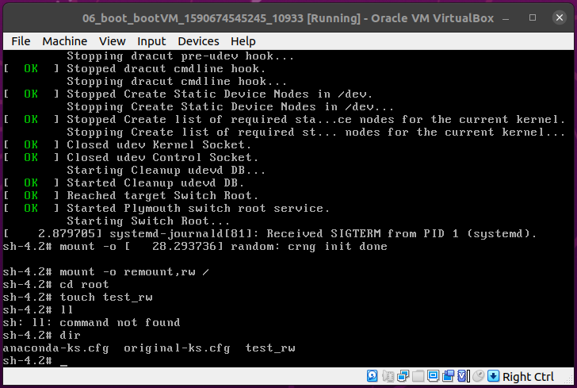
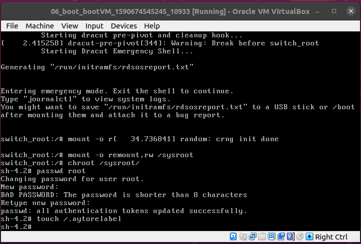
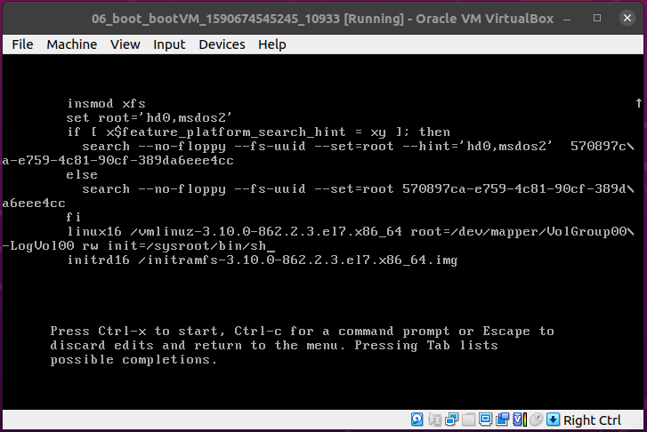
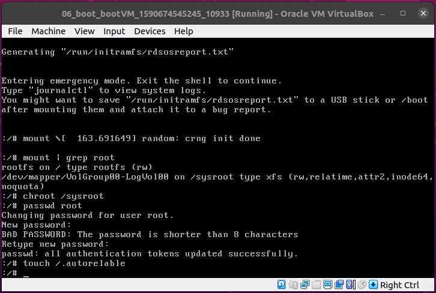
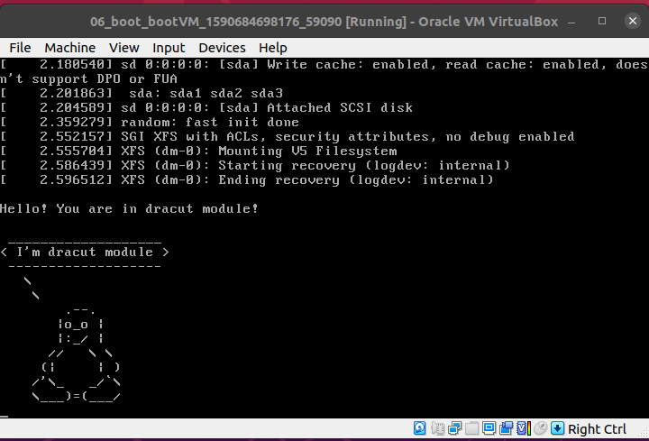

# Загрузка Linux

Необходимо попасть в систему без пароля несколькими способами.

### Способ 1. init=/bin/sh

В конце строки начинающейся с **linux16** добавляем **init=/bin/sh** и нажимаем **сtrl-x** для загрузки в систему


Рутовая файловая система при этом монтируется в режиме **Read-Only**. Если вы хотите перемонтировать ее в режим **Read-Write** можно воспользоваться командой: 

```bash
# mount -o remount,rw /
```

Проверяем созданием файла, смонтировался ли **root**, с правами на запись:



### Способ 2. rd.break

В конце строки начинающейся с **linux16** добавляем **rd.break** и нажимаем **сtrl-x** для загрузки в систему


Попадаем в Emergency mode, система при этом монтируется в режиме **Read-Only**. Меняем пароль от **root** 



### Способ 3. rw init=/sysroot/bin/sh

В конце строки начинающейся с **linux16** заменяем **ro** на **rw init=/sysroot/bin/sh** и нажимаем **сtrl-x** для загрузки в систему





### Переименовываем VG

Ход этой части ДЗ записан [скриптом](hw6)

Смотрим текущее состояние

```bash
[root@bootVM ~]# vgs
  VG         #PV #LV #SN Attr   VSize   VFree
  VolGroup00   1   2   0 wz--n- <38.97g    0 
```

Переименовываем VG

```bash
[root@bootVM ~]# vgrename VolGroup00 OtusRoot
  Volume group "VolGroup00" successfully renamed to "OtusRoot"
```

Далее правим **/etc/fstab, /etc/default/grub, /boot/grub2/grub.cfg**. Везде заменяем старое название на новое. 

Пересоздаем **initrd image**, чтобý он знал новое название **Volume Group**

```bash
[root@bootVM ~]# mkinitrd -f -v /boot/initramfs-$(uname -r).img $(uname -r)
*** Creating image file done ***
*** Creating initramfs image file '/boot/initramfs-3.10.0-862.2.3.el7.x86_64.img' done ***
```

Проверяем

```bash
[root@bootVM ~]# vgs
  VG       #PV #LV #SN Attr   VSize   VFree
  OtusRoot   1   2   0 wz--n- <38.97g    0 
```

### Добавление модуля в initrd

Скрипты модулей хранāтся в каталоге **/usr/lib/dracut/modules.d/**. Для того чтобы добавить свой модуль создаем там папку с именем **01test** и скопируем туда скрипты нашего мудуля

```bash
[root@bootVM ~]# cd /usr/lib/dracut/modules.d
[root@bootVM modules.d]# mkdir 01test
[root@bootVM modules.d]# cd 01test/
[root@bootVM 01test]# cp /tmp/module-setup.sh ./
[root@bootVM 01test]# cp /tmp/test.sh ./
```

Пересобираем образ initrd

```bash
[root@bootVM 01test]# dracut -f -v

*** Creating image file ***
*** Creating image file done ***
*** Creating initramfs image file '/boot/initramfs-3.10.0-862.2.3.el7.x86_64.img' done ***
```

Выключаем опции **rghb** и **quiet** отредактировав файл **grub.cfg**.

Перезагружаемся, проверяем

