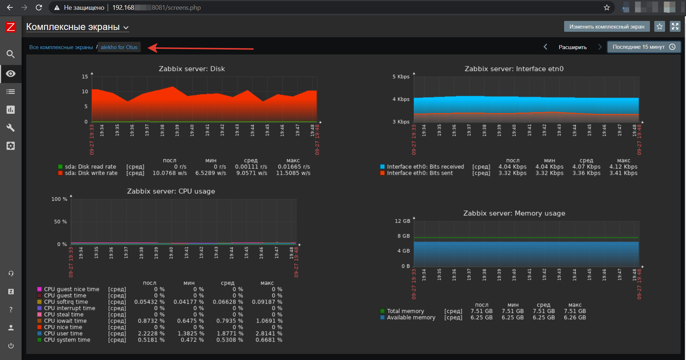

# Monitoring and alerting

По заданию необходимо настроить мониторинг и построить дашборд с 4 графиками.
А почему бы не использовать для этого Docker? )))

Собирается все с помощью [docker-compose](docker-compose.yml).

Дома таким же способом мониторятся все железки, с алертингом на телеграмм, начиная с 5 версии zabbix это удобно делать через хук.