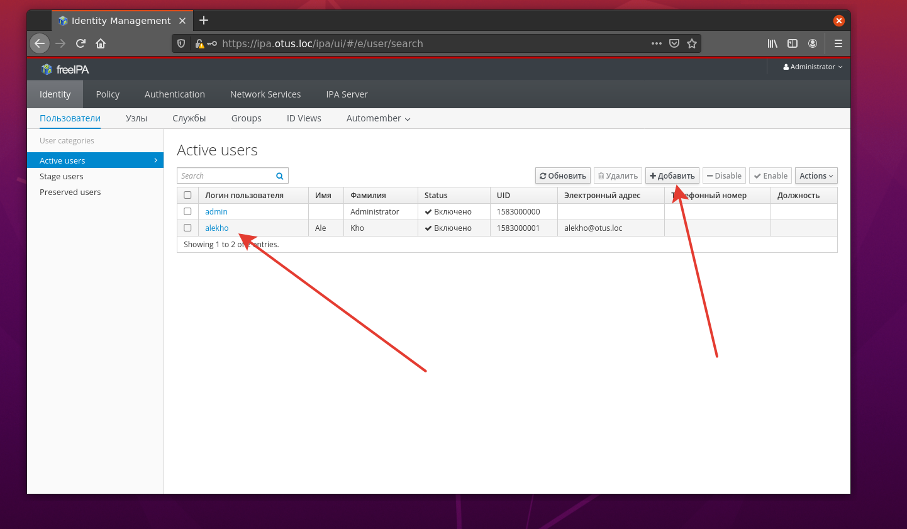

# LDAP

Чтобы запустить выполняем:
```console
git clone https://github.com/freeipa/ansible-freeipa.git && vagrant up
```
Чтобы заработали роли и подцепились хосты меняем **ansible.cfg**
```console
[defaults]
inventory             = inventory/hosts
remote_user           = vagrant
host_key_checking     = False
forks                 = 5
transport             = smart
retry_files_enabled   = False
roles_path   = ansible-freeipa/roles
library      = ansible-freeipa/plugins/modules
module_utils = ansible-freeipa/plugins/module_utils


[diff]
always                = true
context               = 3
```
В [hosts](/inventoryhosts) описываем наши хосты, задаем пароли и домен.

После того как поднимутся VM, последовательно устанавливаем сервер и клиента, запустив плейбуки:
```consile
ansible-playbook -v  install-server.yml 
ansible-playbook -v  install-client.yml
```
Чтобы с хостовой машины подключиться к серверу и клиенту, прописываем в **/etc/hosts**:
```console
192.168.10.10 ipa.otus.loc
192.168.10.20 client.otus.loc
```
Проверяем, заодно делаем авторизацию по ssh-ключу:


Добавляем пользователя:



И ключ для него:


Пробуем заломиться с хостовой машины на клиента:
```console
alekho@ubuntu2004:~/OTUS/32_ldap$ ssh alekho@client.otus.loc
The authenticity of host 'client.otus.loc (192.168.10.20)' can't be established.
ECDSA key fingerprint is SHA256:7moEajrj7aQmdwXuXv2cBrMx7ZVuAavomJvvdgItDXE.
Are you sure you want to continue connecting (yes/no/[fingerprint])? yes
Warning: Permanently added 'client.otus.loc' (ECDSA) to the list of known hosts.
Warning: the ECDSA host key for 'client.otus.loc' differs from the key for the IP address '192.168.10.20'
Offending key for IP in /home/alekho/.ssh/known_hosts:15
Are you sure you want to continue connecting (yes/no)? yes
Could not chdir to home directory /home/alekho: No such file or directory
-sh-4.2$ uname -a
Linux client.otus.loc 3.10.0-1127.el7.x86_64 #1 SMP Tue Mar 31 23:36:51 UTC 2020 x86_64 x86_64 x86_64 GNU/Linux
```
Все работает, **firewalld** и тоже включен.